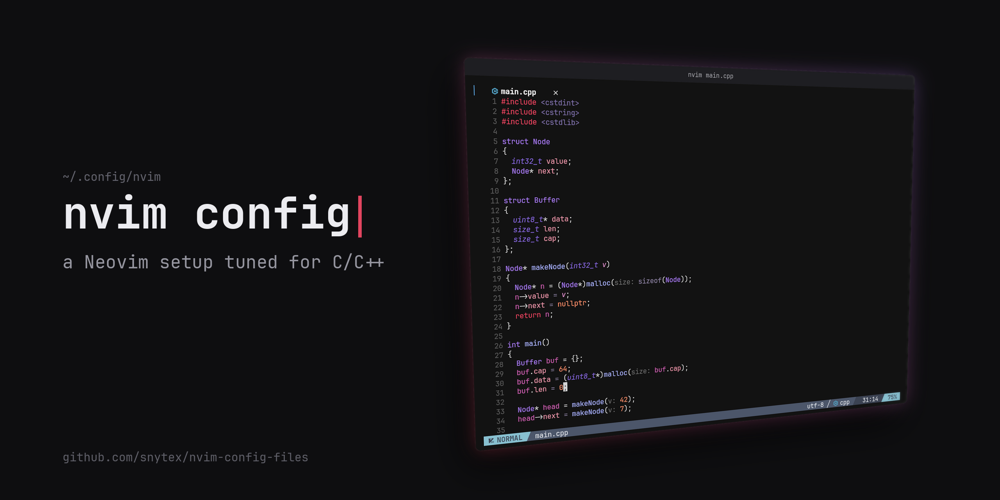

My Neovim setup, tuned for C/C++.

## Requirements

- Neovim 0.12+
- `tree-sitter-cli` (builds the treesitter parsers)
- `gdb` 14+ for debugging
- A Nerd Font

Language servers and formatters (clangd, clang-format, stylua, ...) are installed through Mason on first start.

## Install

```sh
git clone https://github.com/snytex/nvim-config-files ~/.config/nvim
nvim
```

## extras/

- `.clang-format` – global C/C++ format style (copy to `~/.clang-format`)
- `clangd-config.yaml` – global clangd config (copy to `~/.config/clangd/config.yaml`)
- `make_thumbnail.py` – regenerates the image above from `screenshot.png`
